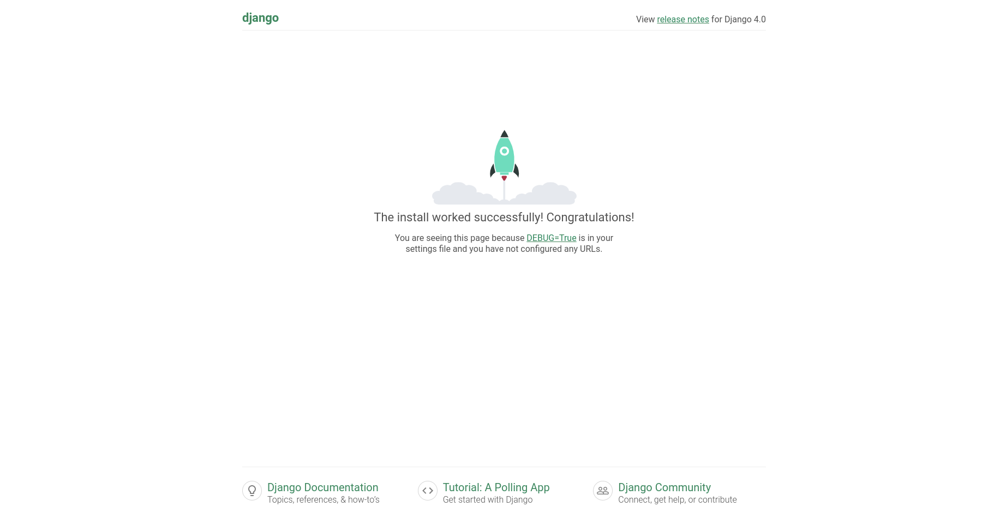

# 💻️🐈‍ CatsWhoCode
A simple Discord Rip-off for Cats Who Code.

## 🔗 Demo link:
Access the working demo at [link](here)

## 🔍️ About The App
`CatsWhoCode` is an online platform to display a minimal feed of `C(h)atRooms` that one can create/join/exit to `meow` about `CatBytes`.

## 📸 Screenshots



## 🧑‍💻 Technologies
I used `django`, `python`, `sqlite3`

## 🏗️ Setup
- Download or clone the repository locally
    ```
    git clone https://github.com/steffincodes/catswhocode.git
    ```
- Move into the repo
    ```
    cd catswhocode
    ```
- Create Virtual Environment
    ```
    pip install virtualenv
    virtualenv <env-name>
    . <env-name>/bin/activate
    ```
- Install the Project requirements
    ```
    pip install -r requirements.txt
    ```

## 🎯 Status
`CatsWhoCode` is still in progress. `Version 1.0` will be out soon.

## 📜 Credits
List of sites reffered to:
- [django Docs](https://docs.djangoproject.com/en/4.0/)
- [Python Django 7 Hour Course](https://www.youtube.com/watch?v=PtQiiknWUcI)

## ⁉️ Disclaimer
Everything in this repo is either Googled, Youtubed or StackOverflowed, and has been built/documented with the sole intention of building a project in the said stack. `Plagiarism` is not the intention. Thanks.